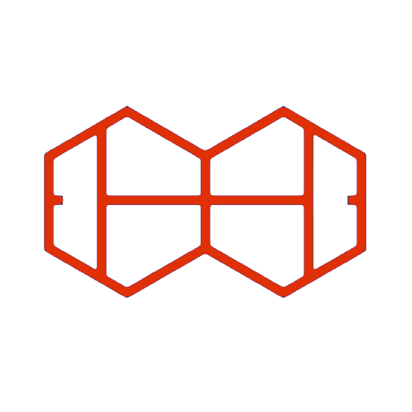

<p align="center">
  <a href="http://courthive.com/" target="blank"></a>
</p>

  <p align="center">CourtHive is an Open Source / Open Data initiative to develop components to support the emergence of a standards based ecosystem of services for competition.</p>
    <p align="center">
<a href="https://www.npmjs.com/~tods-competition-factory" target="_blank"></a>
<a href="https://www.npmjs.com/~tods-competition-factory" target="_blank"></a>
<a href="https://www.npmjs.com/~tods-competition-factory" target="_blank"></a>
</p>

## Description

The **Competition Factory Server** is a production-ready backend for managing tennis and racket sport tournaments, built on [NestJS 11](https://nestjs.com/) and powered by the [tods-competition-factory](https://github.com/CourtHive/tods-competition-factory) engine. It implements the [TODS](https://itftennis.atlassian.net/wiki/spaces/TODS/overview) (Tennis Open Data Standards) data model — the ITF's open specification for representing tournament structures, participants, draws, scheduling, and results.

The server provides a real-time WebSocket gateway (Socket.IO) for client-server mutation synchronization, a REST API for public tournament data, pluggable storage backends (LevelDB or PostgreSQL), Redis-backed caching, JWT authentication with role-based access control, and per-tournament concurrency locks to prevent lost updates from interleaved mutations.

It is designed to work with the [TMX](https://github.com/CourtHive/TMX) tournament management client as its primary frontend, but can serve any client that speaks its WebSocket protocol or REST endpoints.

### Key Features

- **Real-time mutation sync** — Server-first architecture ensures data consistency; clients apply mutations locally only after server acknowledgment
- **Pluggable storage** — Switch between LevelDB (default, zero-config) and PostgreSQL (JSONB) via a single environment variable
- **Role-based access control** — JWT authentication with hierarchical roles (superadmin, admin, client) and provider-scoped permissions
- **Per-tournament locking** — Async mutex with sorted acquisition prevents deadlocks and lost updates from concurrent requests
- **Provider multi-tenancy** — Organizations (providers) manage their own tournaments, users, and calendars in isolation
- **Factory engine integration** — All tournament business logic runs through the shared `tods-competition-factory`, ensuring consistency between client and server
- **Redis caching** — Published tournament data, event data, and schedule info are cached for fast public access

## Documentation

Full setup instructions, architecture guides, and configuration reference are available in the interactive documentation:

**[https://courthive.github.io/competition-factory-server/](https://courthive.github.io/competition-factory-server/)**

The documentation covers:

- **Getting Started** — Prerequisites, installation, and environment configuration
- **Storage** — Pluggable storage architecture, LevelDB setup, PostgreSQL migration
- **Authentication** — Admin account creation, roles and permissions, JWT structure
- **Architecture** — Server modules, mutation flow, WebSocket gateway, provider configuration

## Quick Start

```bash
pnpm install
pnpm watch        # development server with hot reload
```

See the [full documentation](https://courthive.github.io/competition-factory-server/) for Redis setup, environment configuration, storage options, and user creation.

## Testing

```bash
pnpm test          # run all tests
pnpm test:watch    # watch mode
```

## Support

- Author - [Charles Allen](https://github.com/CourtHive)
- Website - [https://CourtHive.com](https://CourtHive.com/)

## License

The Competition Factory Server is [MIT licensed](LICENSE).
