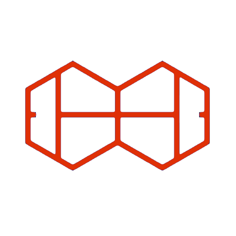

<p align="center">
  <a href="http://courthive.com/" target="blank"></a>
</p>

  <p align="center">CourtHive is an Open Source / Open Data initiative to develop components to support the emergence of a standards based ecosystem of services for competition.</p>
    <p align="center">
<a href="https://www.npmjs.com/~tods-competition-factory" target="_blank"></a>
<a href="https://www.npmjs.com/~tods-competition-factory" target="_blank"></a>
<a href="https://www.npmjs.com/~tods-competition-factory" target="_blank"></a>
</p>

## Description

Lightweight NestJS example server for testing client/server use cases with tods-competition-factory

## Installation

```bash
$ pnpm install
```

## Redis

Make sure you have [Redis](https://redis.io/docs/latest/operate/oss_and_stack/install/install-redis/install-redis-on-linux/) installed

## .env file

Create an `.env` file in the root directory.

```txt
APP_STORAGE='fileSystem' # 'levelDB' or 'fileSystem'
APP_NAME='Competition Factory Server'
APP_MODE='development' # 'production'
APP_PORT=8383

JWT_SECRET='Replace this string with a truly random string'
JWT_VALIDITY=2h

TRACKER_CACHE='cache'

REDIS_TTL= 8 * 60 * 60 * 1000
REDIS_HOST='localhost'
REDIS_USERNAME=''
REDIS_PASSWORD=''
REDIS_PORT=6379

DB_HOST=localhost
DB_PORT=3838
DB_USER=admin
DB_PASS=adminpass

MAILGUN_API_KEY='your-mailgun-api-key'
MAILGUN_HOST='api.eu.mailgun.net'
MAILGUN_DOMAIN='m.your.domain'
```

## Storage

By default the server will store tournaments in the file system. In order to use `levelDB` to persist tournament records, `net-level-server` must be running.

```bash
$ pnpm hive-db
```

## Running the app

If you have PM2 installed:

```bash
pm2 start ecosystem.config.js
```

...otherwise...

```bash
# development
$ pnpm start

# watch mode
$ pnpm watch

# production mode
$ pnpm start:prod
```

## Test

```bash
# unit tests
$ pnpm test controller
$ pnpm test factory
$ pnpm test service

# e2e tests
$ pnpm test e2e

# test coverage
$ pnpm run test:cov
```

## Development User Creation

In order for Tournaments to persist, you need to create a user that is backed by a 'provider'.

If running in development, point a [TMX](https://github.com/CourtHive/TMX) frontend instance at your server, use the test user username: `alex@castle.com` password: `castle` to login.

Create your provider, then create a user with that provider.

The frontend will copy the invite link to your clipboard in order to complete that user, use that and complete your account.

Logout of `alex@castle.com` and into your newly created account.

Tournaments should now persist on the LevelDB/filesystem.

## Support

- Author - [Charles Allen](https://github.com/CourtHive)
- Website - [https://CourtHive.com](https://CourtHive.com/)

## License

The Competition Factory is [MIT licensed](https://github.com/nestjs/nest/blob/master/LICENSE).
